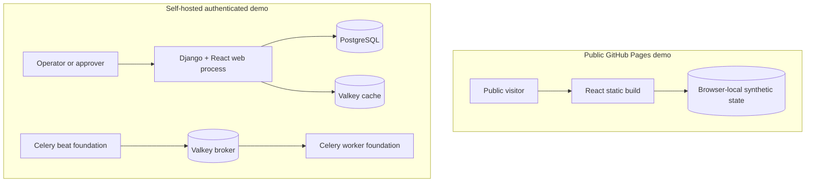
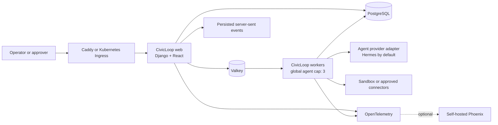

# CivicLoop v1 Architecture Design

**Status:** Approved target architecture; implementation in progress  
**Decision date:** 2026-07-30  
**Last reconciled with the repository:** 2026-08-04  
**License:** MIT  
**First workflow:** LaunchLoop  
**Deployment model:** One nonprofit organization per deployment

## 1. Purpose

CivicLoop is an open-source, self-hosted application for safe, observable agentic workflows in nonprofit operations. It turns the LaunchLoop demonstration into a production-quality vertical slice while establishing reusable foundations for later membership, sponsor, communications, reporting, and data-quality loops.

The product is a human-approved operations copilot, not an autonomous back-office system. Deterministic application code owns workflow state, authorization, policy enforcement, approvals, and external actions. An agent runtime may perform bounded language and reasoning tasks through narrowly scoped tools, but agent output never authorizes or invokes a consequential integration by itself.

This document records both:

- the approved v1 architecture toward which CivicLoop is evolving; and
- the smaller architecture that is actually implemented in the repository today.

Where those differ, the current-state sections are authoritative about the code and the target-state sections describe planned work.

## 2. Architectural Principles

1. **Human approval before consequence.** Drafting and validation may be automated; sending, publishing, pricing, discount, audience, and data-export actions remain approval-gated.
2. **Deterministic code owns control.** State transitions, role checks, policy calculations, package hashes, idempotency, and connector execution belong to application code rather than prompts.
3. **PostgreSQL is the system of record.** Valkey is disposable queue and cache infrastructure and must never contain the only durable copy of workflow state.
4. **Inputs are revisioned and outputs are reviewable.** A run reads one immutable event revision and produces a package that can be inspected, hashed, approved, and audited.
5. **Fail closed at trust boundaries.** Missing data, stale package hashes, role mismatches, unsupported audiences, and policy mismatches stop progression.
6. **Operational dependencies degrade safely.** Loss of an optional agent or observability service must not erase accepted work or bypass controls.
7. **Start as a modular monolith.** Keep deployment and transactions simple while maintaining internal seams that can be extracted only when evidence justifies it.
8. **Use synthetic data until production controls exist.** Public and authenticated demos contain no real nonprofit, constituent, sponsor, payment, or credential data.

## 3. Approved Product Decisions

- One nonprofit organization per v1 deployment; multi-tenancy is deferred.
- Invite-only internal users in production.
- Operator and approver responsibilities are separate, with no self-approval by default.
- Hermes is the intended default agent provider behind a stable adapter, not a dependency of the workflow domain.
- CivicLoop remains operational when Hermes or Phoenix is unavailable.
- LaunchLoop begins with sandbox connectors rather than live Eventbrite, Iterable, or social credentials.
- Docker Compose is the current deployment baseline; Kubernetes and Helm remain v1 distribution targets.
- CivicLoop core and reusable loops remain MIT licensed.
- Open-source, self-hostable components are preferred; proprietary SaaS is not required.
- The deployment-wide target is at most three concurrent agent tasks.

## 4. Current Implementation Snapshot

As of 2026-08-04, the repository contains a working deterministic LaunchLoop vertical slice and the runtime foundation around it.

| Area | Implemented now | V1 target not yet implemented |
| --- | --- | --- |
| User experience | React mission-control workspace, event brief, three visible lanes, review package, approval panel, receipt, and timeline | General event management, Focus mode, decision queue, operational metrics, and full accessibility verification |
| Authentication | Django sessions and CSRF; two seeded synthetic accounts mapped to operator and approver roles | First-run admin, invitations, password reset, session administration, TOTP MFA, rate limiting, and production identity lifecycle |
| Workflow | Durable event revisions, workflow transitions, deterministic package generation, missing-input remediation, submission, approval/rejection, and completion | Durable task orchestration, agent runs and steps, retries, cancellation, leases, outbox, and live activity streaming |
| Safety | Server-enforced roles, self-approval prohibition, exact package hash check, deterministic audience and sponsor validation, no external action | Named permission model, policy versioning, capability tokens, emergency override controls, redaction framework, and kill switch |
| Integrations | A persisted `sandbox_iterable` simulation receipt with zero external actions | Formal connector interfaces, Eventbrite sandbox, failure simulation, reconciliation, and live connectors |
| Agents | Deterministic Python package engine and six standalone LaunchLoop eval scenarios | Hermes adapter, bounded specialist tasks, JSON Schema validation/repair, provider metadata, and global concurrency semaphore |
| Data | PostgreSQL models and migrations for the authenticated demo; browser-local state for GitHub Pages | Full identity, organization, agent, policy, outbox, metrics, and retention models |
| Runtime | One multi-stage image; Django/Gunicorn web, Celery worker, Celery beat scheduler, PostgreSQL, Valkey, health endpoints, read-only app containers | Real background workflow tasks, Caddy/TLS distribution, Mailpit, Phoenix, backup/restore tooling, and production secrets files |
| Delivery | GitHub Actions tests and GitHub Pages deployment; Docker Compose development and production-oriented local files | Signed multi-architecture releases, SBOM and image scanning, Helm chart, Kubernetes tests, and release/rollback automation |

The Celery worker and scheduler are foundation process modes today. The only Celery task is a smoke-test `ping`; the interactive LaunchLoop path executes synchronously in Django. Likewise, `AGENT_MAX_CONCURRENCY` is parsed and capped at three, but no agent runtime or cross-process semaphore is connected yet.

## 5. System Context

CivicLoop currently has two deliberately different demo modes.

The public demo does not call Django and does not expose the seeded accounts. It uses synthetic state persisted in the visitor's browser. The self-hosted application uses same-origin JSON endpoints, Django sessions, PostgreSQL records, and server-side role enforcement.

## 6. Target Runtime Architecture

CivicLoop v1 remains a modular monolith with independently runnable web, worker, and scheduler processes. The same versioned image runs in each mode:

1. `web` serves the Django API, session-authenticated application, React assets, and eventually server-sent event streams;
2. `worker` processes queued deterministic and bounded agent tasks; and
3. `scheduler` enqueues maintenance and reconciliation work.

PostgreSQL remains the only required durable backup. A future transactional outbox will make task publication recoverable. Valkey failure will stop new dispatch without losing accepted state; PostgreSQL failure will make mutations fail closed; Phoenix failure will not fail business workflows.

## 7. Technology Stack

| Concern | Current selection | Architectural role |
| --- | --- | --- |
| Backend | Django 5.2, Python 3.11 | API, sessions, authorization, ORM, migrations, and domain services |
| Frontend | React 19, TypeScript, Vite | Interactive operator and approver application; static demo build |
| Durable data | PostgreSQL 17 | Canonical transactional source of truth |
| Cache and broker | Valkey 8 | Redis-compatible cache and Celery transport |
| Background work | Celery 5.6 | Worker and scheduler foundation; planned workflow execution |
| Web serving | Gunicorn and WhiteNoise | WSGI application and built React assets |
| Packaging | Docker multi-stage image, Compose | Reproducible web/worker/scheduler runtime |
| Python tooling | uv, pytest, Ruff, mypy | Locked dependencies, tests, linting, and type checks |
| Frontend testing | Vitest and Testing Library | Component and browser-like interaction checks |
| Agent runtime target | Hermes behind an adapter | Provider-flexible bounded reasoning; not integrated yet |
| Telemetry target | OpenTelemetry and optional Phoenix | Vendor-neutral tracing and agent-run inspection; not integrated yet |
| Kubernetes target | Helm | Future production packaging; not present yet |

Versions are pinned in lockfiles or container tags and upgraded through reviewed changes.

## 8. Repository and Module Boundaries

The public CivicLoop repository contains distributable application source, migrations, synthetic data, deterministic evals, generic Compose configuration, public CI, and contributor-facing documentation. Environment-specific infrastructure, hostnames, secret references, operational runbooks, and release promotion belong in the separate production operations repository. Production deploys a pinned CivicLoop commit or immutable image.

The implemented backend modules are:

- `civicloop`: Django configuration, URL routing, WSGI/ASGI entry points, and Celery setup;
- `health`: liveness and PostgreSQL/Valkey readiness checks;
- `foundation`: process-foundation tasks, currently the Celery `ping` task; and
- `launchloop`: demo domain models, deterministic package engine, application services, and API views.

The target modular-monolith boundaries are:

- `identity`: invitations, MFA, sessions, roles, and named permissions;
- `organization`: singleton organization profile and deployment policy;
- `events`: events, immutable revisions, and reference data;
- `workflows`: state machine, coordination, outbox, leases, retries, and cancellation;
- `agents`: provider interface, Hermes adapter, schemas, capabilities, and concurrency;
- `launchloop`: prompts, deterministic policies, package assembly, and evals;
- `approvals`: requests, decisions, overrides, and package hashes;
- `integrations`: connector contracts, sandbox adapters, idempotency, and receipts;
- `audit`: append-only security and business events; and
- `observability`: metrics, tracing, liveness, and readiness.

As these modules are extracted, views and tasks should call application services and typed contracts rather than mutating another module's models directly.

## 9. Current Domain and Data Model

The authenticated demo persists these entities:

| Entity | Current purpose and important constraint |
| --- | --- |
| Django `User` | Session-authenticated identity for seeded demo users |
| `DemoActor` | Maps a user to an operator or approver persona |
| `Event` | Stable event identity; one current workflow per event |
| `EventRevision` | Immutable JSON snapshot, version, and author; version unique per event |
| `Workflow` | UUID lifecycle aggregate, selected revision, generated package, and SHA-256 package hash |
| `WorkflowTransition` | Durable actor-attributed state history used by the timeline |
| `ApprovalRequest` | One request per workflow, submitter, approver, decision, and locked package hash |
| `ConnectorExecution` | One idempotent simulated delivery receipt per approval |
| `AuditEvent` | Actor, action, target, and structured details for consequential service actions |

The model is intentionally single-organization and has no tenant identifier. Adding multi-tenancy would affect nearly every authorization query and must be a deliberate future architecture decision.

The target model additionally introduces `Invitation`, `OrganizationSettings`, `AgentRun`, `AgentStep`, `DraftAsset`, `PolicyVersion`, `ApprovalDecision`, and `OutboxEvent`. It will also strengthen audit immutability, retention metadata, and correlation identifiers.

## 10. LaunchLoop Workflow

### Implemented state machine

```mermaid
stateDiagram-v2
    [*] --> Draft: reset synthetic demo
    Draft --> NeedsInput: run; required facts missing
    NeedsInput --> Draft: operator creates a new revision
    Draft --> ReadyForReview: rerun; deterministic checks pass
    ReadyForReview --> InReview: operator submits package hash
    InReview --> Draft: approver rejects
    InReview --> Approved: different approver accepts exact hash
    Approved --> Completed: sandbox receipt recorded
```

The service layer uses database transactions and row locks for workflow mutations. Expected-state checks prevent actions from being applied out of order. Resolving missing facts creates a new `EventRevision`; it does not modify the previous snapshot. Submitting locks the generated package by its canonical JSON SHA-256 hash. Approval requires an approver who is not the submitter and a client-presented hash matching the stored approval hash.

On approval, CivicLoop currently records a deterministic `sandbox_iterable` receipt and then marks the workflow complete. The receipt explicitly reports simulation mode and zero external actions.

### Package preparation

The deterministic engine currently:

- validates required event fields;
- preserves placeholders and asks structured questions for missing facts;
- drafts invitation, reminder, and social content from the event snapshot;
- selects only a configured geography-specific audience;
- recomputes sponsor discount expectations and derived ticket price;
- assigns statuses to Event Readiness, Campaign Composer, and Audience and Policy lanes; and
- records human-readable evidence that no external action was taken.

The implemented engine is intentionally deterministic. The three lanes are visible workflow concerns, not three running agents yet.

### Target agent-assisted workflow

A future run may fan out to three bounded specialists:

1. **Event Readiness** checks completeness and proposes structured questions.
2. **Campaign Composer** drafts invitation, reminder, and social assets.
3. **Audience and Policy** recommends an approved audience and evaluates language, sponsor, and action-boundary policy.

Before any package becomes review-ready, deterministic code will validate agent responses against versioned schemas, recompute price and discount math, check approved audience IDs, detect unresolved placeholders, apply versioned policies and capabilities, and record prompt and policy versions. Agent output will not invoke a connector directly.

## 11. Identity, Authorization, and Approval

### Current controls

- Django authenticates the self-hosted demo with server-side sessions.
- CSRF middleware and same-origin requests protect state-changing browser calls.
- Every workflow action resolves the authenticated user to a server-side role.
- Operators can reset the sandbox, run LaunchLoop, resolve facts, and submit a package.
- Approvers can decide a pending package and cannot approve their own submission.
- The package hash prevents approval of a package different from the reviewed version.
- Demo credentials are synthetic fixtures and must not be used in a real deployment.

The public static demo has a UI persona switch for demonstration purposes only. It is not an authorization system.

### Target production controls

- One-time first-admin setup and expiring, single-use hashed invitations.
- Named backend permissions; UI visibility is never the authorization boundary.
- Argon2id passwords, secure HTTP-only SameSite cookies, and CSRF on all mutations.
- Password reset and user disablement revoke existing sessions.
- TOTP MFA is required for approvers in production mode.
- Authentication and invitation endpoints are rate-limited.
- Emergency self-approval requires reauthentication, MFA, a reason, a high-severity audit event, and a persistent receipt warning.
- Production startup fails for unsafe secrets, cookies, or bootstrap configuration.

## 12. API Contracts

The current browser API is same-origin, session-authenticated JSON under `/api/v1`:

| Method and path | Purpose |
| --- | --- |
| `GET /auth/session` | Return the authenticated demo actor |
| `POST /auth/login` | Authenticate a seeded synthetic account |
| `POST /auth/logout` | End the current session |
| `GET /demo` | Serialize the current workspace |
| `POST /demo/reset` | Recreate the synthetic workflow; operator only |
| `POST /workflows/{id}/runs` | Run deterministic package preparation; operator only |
| `POST /workflows/{id}/answers` | Create a revision from required answers; operator only |
| `POST /workflows/{id}/submit` | Create an approval request for the package hash; operator only |
| `POST /approvals/{id}/decision` | Approve or reject; approver and exact hash required |
| `GET /health/live` | Process liveness without dependency checks |
| `GET /health/ready` | PostgreSQL and Valkey readiness |

Errors currently return a stable `code` and user-safe `message`, with the appropriate HTTP status. The target API will adopt a versioned problem-details envelope with correlation IDs and field errors, add explicit event, invitation, agent capacity, audit, and approval-list endpoints, and require idempotency keys for consequential mutations.

Persisted server-sent events at `/api/v1/workflows/{id}/events` are planned for activity replay and reconnect; they do not exist today.

## 13. Agent Safety Boundary

Hermes is the intended bundled default but must be treated as an untrusted execution dependency:

- tasks receive minimal structured payloads, not unrestricted database access;
- each run receives a short-lived capability restricted to a workflow, revision, tools, and expiry;
- tools are allowlisted per specialist;
- workers receive no Docker socket, host filesystem, or cluster credentials;
- integration secrets never appear in prompts or agent-readable environment variables;
- event, policy, and connector text is untrusted data, not instructions;
- tool results and outputs are size-limited, schema-validated, and redacted before persistence;
- a global kill switch can stop new agent work without disabling review of stored work; and
- tool calls carry workflow, actor, capability, request, and trace identifiers.

The provider adapter isolates workflow and approval logic from Hermes so a local or remote runtime can be substituted without changing domain invariants.

## 14. Reliability and Idempotency

The current service layer already provides atomic mutations, row locking on the primary workflow path, expected-state checks, a stable package hash, and a unique connector idempotency key.

The target reliability design adds:

- a transactional outbox committed with accepted workflow work;
- workers with expiring database leases and heartbeats;
- a reconciler for undispatched outbox records and expired leases;
- bounded exponential retry with jitter and explicit retryability;
- one bounded schema-repair attempt for invalid agent output;
- cooperative cancellation with a durable partial-completion record;
- persisted stream events replayed from the last received event ID; and
- a database-backed deployment-wide semaphore enforcing at most three active agent tasks across processes and pods.

No business transition may depend solely on Celery acknowledgement or a Valkey record.

## 15. Connector Boundary

Sandbox and future live adapters must implement the same contract:

- validate configuration;
- prepare a redacted request preview;
- require an approved package hash;
- execute using an idempotency key;
- return a typed, redacted receipt;
- classify failures as retryable or permanent; and
- expose a health check.

Sandbox adapters never call a vendor. They should cover success, transient failure, permanent validation failure, duplicate delivery, timeout, and reconciliation scenarios. Live Eventbrite, Iterable, and social actions remain deferred until security, privacy, connector contract, and end-to-end approval tests are complete.

## 16. Security, Privacy, and Retention

- No real member, donor, sponsor, volunteer, employee, attendee, payment, or credential data belongs in demos or automated tests.
- Consequential authentication, authorization, approval, override, export, policy, integration, and agent-tool events must be audited.
- Sensitive values must be redacted before logs, traces, receipts, or error responses.
- Audit export is approver-only and is itself audited.
- Target defaults are 30 days for application logs and agent traces and 365 days for business and audit records, configurable by the operator.
- Approval and audit deletion requires explicit administrative maintenance rather than ordinary application flows.
- Database backups are encrypted outside the application and excluded from ordinary user access.

The present `AuditEvent` model is an implementation step, not yet a complete append-only or retention-enforced audit subsystem.

## 17. Observability and Health

Implemented health contracts separate liveness from readiness:

- liveness reports whether the web process can answer; and
- readiness verifies PostgreSQL and Valkey with a `SELECT 1` and a short cache round trip.

The target system adds structured logs with request, workflow, task, actor, and trace IDs; OpenTelemetry spans across HTTP, Celery, agent, and connector boundaries; and metrics for queue age, duration, active agent slots, retries, failures, approval trends, overrides, and outbox lag.

Phoenix is an optional deep technical trace view. Its absence must never block login, deterministic work, review, approval, or connector reconciliation.

## 18. Deployment and Operations

### Implemented Compose distribution

The multi-stage Dockerfile builds the React application, installs the locked Python environment, collects static assets, and produces a non-root runtime image. The image is reused for:

- `web`: Gunicorn serving Django and the React single-page application;
- `worker`: Celery worker;
- `scheduler`: Celery beat; and
- `manage`: one-shot Django management commands.

Application containers use a read-only root filesystem and `/tmp` tmpfs. Compose starts PostgreSQL and Valkey with health checks, runs migrations as a one-shot service, and gates the application on its dependencies. PostgreSQL uses a named persistent volume; Valkey is configured as disposable cache/broker state. The development override adds Vite hot reload and mounts backend source.

Environment configuration currently arrives through `.env`. Production operators must replace every documented placeholder. Secret-file mounting, Caddy TLS, Mailpit, Phoenix profiles, and backup/restore commands remain planned.

### Target Kubernetes distribution

The planned OCI Helm chart provides web and worker Deployments, a singleton scheduler, migration Job, Services, configurable Ingress, probes, resource limits, disruption budgets, NetworkPolicies, namespace-scoped service accounts, and checksum-driven configuration rollouts.

The chart defaults to the Restricted Pod Security Standard: non-root IDs, read-only root filesystems, no privilege escalation, dropped capabilities, runtime-default seccomp, and no host paths, host networking, or Docker socket. Production values expect external or operator-managed PostgreSQL and Valkey. Kubernetes packaging is not present in the current repository.

## 19. Testing and Release Gates

The repository currently tests:

- Django settings and static SPA routing;
- health and readiness behavior;
- Celery foundation configuration;
- LaunchLoop engine and authenticated demo API behavior;
- runtime filesystem and delivery configuration;
- React components and the static browser-local journey; and
- six deterministic LaunchLoop evaluation cases covering a happy path, missing venue, remediation, sponsor mismatch, refusal of unapproved action, and unsupported audience judgment.

The target release gate expands this with property and concurrency tests, identity/MFA tests, shared connector contract tests, migration safety, prompt-injection and schema-invalid evals, full browser accessibility tests, Compose and `kind` smoke tests, outage recovery, image scanning, SBOM generation, provenance signing, and immutable semantic-version publication.

## 20. Scope and Delivery Sequence

### V1 scope

V1 includes production identity and authorization, event revisioning, three bounded specialist lanes, durable run history, package generation and deterministic validation, questions and remediation, four-eyes approval, sandbox connectors, audit and operational metrics, agent observability, Compose hardening, and Helm/Kubernetes packaging.

Deferred work includes membership lifecycle, sponsor-domain eligibility, Stripe payments, live third-party actions, multi-organization tenancy, autonomous consequential actions, native mobile applications, and complex conference workflows.

### Reconciled delivery sequence

1. **Completed foundation:** repository, React shell, single image, Compose services, health/readiness, CI, and GitHub Pages.
2. **Completed demo vertical slice:** durable event revisions and workflow state, deterministic three-lane package, missing-input remediation, package hash, separate synthetic operator/approver sessions, sandbox receipt, and timeline.
3. **Next production boundary:** replace demo identity with setup, invitations, named permissions, password lifecycle, MFA, session controls, and hardened audit.
4. **Durable execution:** outbox, work items, leases, retries, cancellation, persisted activity events, and deployment-wide concurrency control.
5. **Agent integration:** provider adapter, Hermes worker integration, structured schemas, capability-scoped tools, policy/prompt versioning, and expanded evals.
6. **Connector contracts:** formal sandbox Eventbrite and Iterable adapters, idempotent execution, failure simulation, and reconciliation.
7. **Operational maturity:** metrics, OpenTelemetry, optional Phoenix, retention, backup/restore, and production Compose edge/security documentation.
8. **Distribution maturity:** Helm chart, Kubernetes security, `kind` tests, multi-architecture images, SBOM, signing, and release automation.

Each increment must remain runnable, tested, and documented before the next broadens the trust boundary.

## 21. V1 Acceptance Criteria

The approved v1 architecture is complete only when:

1. A clean Compose installation can create the first approver and invite an operator.
2. A clean Helm installation on `kind` passes the same readiness and workflow smoke tests.
3. An operator can create an event revision and observe up to three bounded specialist tasks.
4. Missing information creates structured questions instead of invented values.
5. A valid package passes deterministic checks and enters the approval queue.
6. The submitter cannot approve the package.
7. A different approver can approve the exact reviewed package hash.
8. A sandbox connector produces an idempotent typed receipt without a vendor call.
9. Every consequential step is reconstructable from durable workflow and audit records.
10. Browser, worker, broker, and optional Phoenix interruptions do not corrupt accepted state.
11. Deterministic tests, agent evals, and sandbox end-to-end tests pass.
12. Published images and charts are versioned, scanned, signed, documented, and reproducible.

The current repository demonstrates criteria 4, 6, and 7 in the authenticated synthetic path and a narrow form of criteria 5 and 8. It does not yet satisfy the v1 release criteria as a whole.

## 22. Consequences and Trade-offs

The modular monolith keeps transactions, deployment, and contributor onboarding tractable, but requires disciplined module interfaces as the application grows. One organization per deployment avoids premature tenant isolation complexity, but future multi-tenancy will be a substantial migration. Session authentication fits the first-party web application, while third-party API clients would require a separate authentication decision.

Keeping agents behind deterministic validation reduces autonomy and may require more human review, but it makes behavior inspectable and policy enforcement testable. PostgreSQL-backed durability adds operational weight compared with a static demo, but it is necessary for approvals, auditability, recovery, and idempotency. Running Valkey as disposable infrastructure simplifies backup, provided no accepted state is ever stored only in the broker.

Finally, maintaining both a browser-local public demo and an authenticated server demo introduces two state implementations. That duplication is acceptable while the public site must remain safe and hostable on GitHub Pages, but behavior shared by both modes must remain covered by parallel tests to prevent drift.
