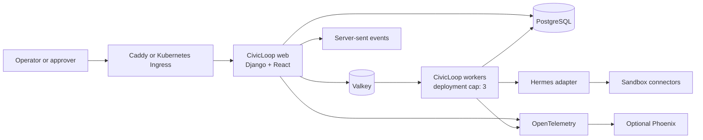
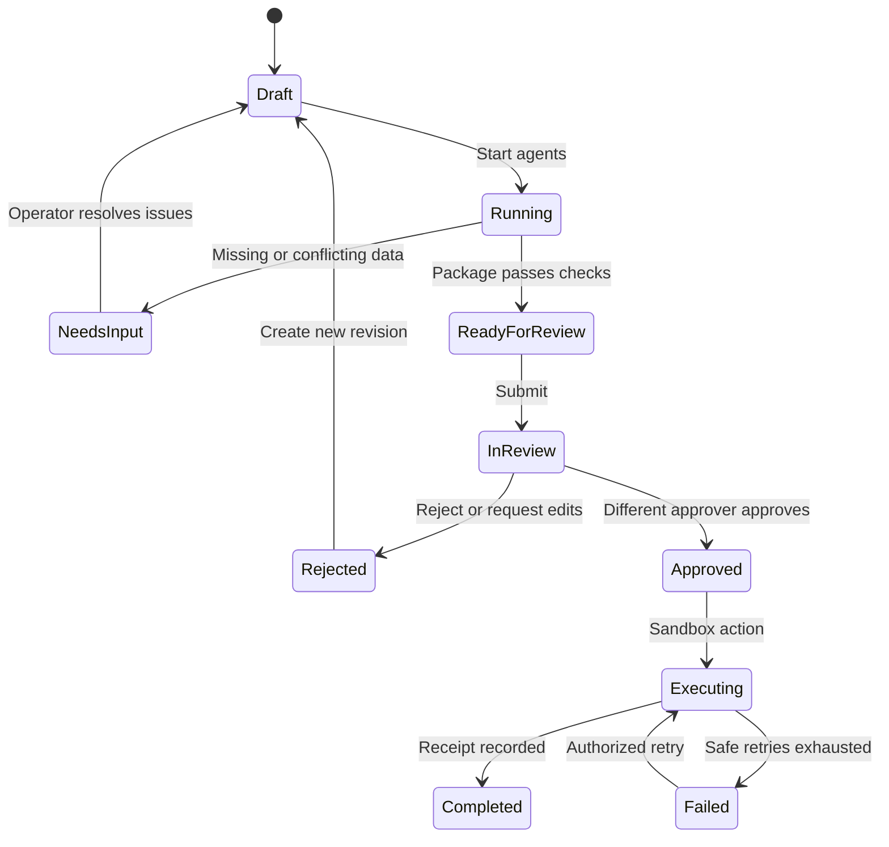

# CivicLoop v1 Architecture Design

**Status:** Approved

**Date:** 2026-07-30

**License:** MIT

**First production workflow:** LaunchLoop

**Deployment model:** One nonprofit organization per deployment

## 1. Purpose

CivicLoop is an open-source, self-hosted application for safe, observable agentic workflows in nonprofit operations. It turns the existing LaunchLoop demonstration into a production-quality vertical slice while establishing reusable foundations for later membership, sponsor, communications, reporting, and data-quality loops.

The product is a human-approved operations copilot, not an autonomous back-office system. Deterministic application code owns workflow state, authorization, policy enforcement, approvals, and external actions. Hermes performs bounded language and reasoning tasks through narrowly scoped tools.

## 2. Approved Product Decisions

- One nonprofit organization per v1 deployment.
- Invite-only internal users.
- Two visible roles: general user/operator and admin/approver.
- No self-approval by default.
- Hermes is the bundled default agent provider behind a stable adapter.
- CivicLoop remains operational if Hermes or Phoenix is unavailable.
- LaunchLoop initially uses realistic sandbox connectors rather than live Eventbrite or Iterable credentials.
- Docker Compose and Kubernetes are both first-class v1 deployment targets.
- The reusable loops and core application remain MIT licensed.
- Open-source, self-hostable components are preferred; no proprietary SaaS is required.
- Up to three Hermes agent tasks may run concurrently across the whole deployment.

## 3. V1 Scope

### Included

- First-run setup and initial admin creation.
- Login, logout, password reset, session revocation, and TOTP MFA.
- Expiring, single-use email invitations.
- Operator and admin/approver authorization.
- Mission-control operator workspace with optional Focus mode.
- Event creation, revision history, and structured validation.
- Three visible Hermes specialist lanes.
- Durable agent-run history and live activity streaming.
- Generated invitation, reminder, and social assets.
- Audience, sponsor-discount, language, and action-boundary validation.
- Questions and remediation when event information is incomplete.
- Decision-queue-first approver dashboard.
- Four-eyes approval, rejection, edit requests, and emergency override audit.
- Sandbox Eventbrite and Iterable contracts and execution receipts.
- Native operational metrics and searchable/exportable audit records.
- OpenTelemetry traces and optional self-hosted Phoenix.
- Docker/Compose and Helm/Kubernetes packaging.
- Contributor, operator, backup, restore, upgrade, and security documentation.

### Deferred

- Membership lifecycle and public member registration.
- Sponsor-domain membership and Stripe payments.
- Live Eventbrite, Iterable, or social-network actions.
- Multi-organization tenancy.
- Autonomous consequential actions.
- Native mobile applications.
- Complex conference workflows or multiple event templates.

## 4. Architecture Strategy

CivicLoop v1 is a modular monolith with independently runnable web, worker, and scheduler processes. This avoids premature distributed-system complexity while retaining explicit internal interfaces that can be extracted later.

The same versioned CivicLoop container image runs in three modes:

1. `web` serves the Django API, session-authenticated application, React assets, and server-sent event streams.
2. `worker` processes queued deterministic and Hermes tasks.
3. `scheduler` enqueues periodic maintenance and reconciliation tasks.

PostgreSQL is the durable system of record. Valkey provides cache and queue transport but never stores the only copy of workflow state. A transactional outbox makes queued work recoverable.

## 5. Open-Source Technology Stack

| Concern | Selection | Rationale |
| --- | --- | --- |
| Backend | Django 5.2 LTS, Python | Mature authentication, sessions, ORM, migrations, security controls, and Python affinity with Hermes |
| Frontend | React, TypeScript, Vite | Strong interactive UI and contributor ecosystem |
| Durable data | PostgreSQL | Canonical transactional source of truth |
| Cache and broker | Valkey | Community-governed Redis-compatible server |
| Background work | Celery | Mature distributed task processing, scheduling, retries, and worker controls |
| Agent runtime | Hermes Agent | MIT-licensed, provider-flexible agent runtime with delegation support |
| Edge for Compose | Caddy | Automatic HTTPS and production reverse proxying |
| Email development | Mailpit | Local SMTP capture without an external provider |
| Telemetry | OpenTelemetry | Vendor-neutral traces and metrics |
| Agent observability | Arize Phoenix | Open-source, self-hosted OTLP collection and trace UI |
| Kubernetes packaging | Helm | Standard application packaging and release management |
| Testing | pytest, Vitest, Playwright | Unit, component, integration, and browser coverage |
| Static quality | Ruff, mypy, ESLint, TypeScript | Automated correctness and consistency gates |
| Supply-chain checks | Trivy, Syft, Cosign | Vulnerability scanning, SBOM generation, and signing |

Framework and tool versions will be pinned in lockfiles and container digests. At implementation kickoff, current supported versions will be selected from official documentation and then upgraded through reviewed dependency pull requests.

References:

- [Django 5.2 release series](https://docs.djangoproject.com/en/5.2/releases/)
- [Celery documentation](https://docs.celeryq.dev/en/stable/)
- [Celery with Redis-compatible brokers](https://docs.celeryq.dev/en/latest/getting-started/backends-and-brokers/redis.html)
- [Valkey Redis OSS compatibility](https://valkey.io/topics/migration/)
- [Hermes Agent](https://github.com/NousResearch/hermes-agent)
- [Phoenix Docker self-hosting](https://arize.com/docs/phoenix/self-hosting/deployment-options/docker)
- [Caddy automatic HTTPS](https://caddyserver.com/docs/caddyfile/options)
- [Helm architecture](https://helm.sh/docs/topics/architecture/)

## 6. Module Boundaries

The backend is divided into focused Django applications:

- `identity`: users, invitations, MFA, sessions, roles, and permissions.
- `organization`: the singleton organization profile and deployment policy settings.
- `events`: event records, immutable revisions, and reference data.
- `workflows`: state machine, task coordination, outbox, leases, and retries.
- `agents`: provider interface, Hermes implementation, run capabilities, schemas, and concurrency control.
- `launchloop`: LaunchLoop prompts, deterministic rules, package assembly, and evals.
- `approvals`: approval requests, decisions, overrides, and package hashes.
- `integrations`: connector contracts, sandbox adapters, idempotency, and receipts.
- `audit`: append-only security and business audit events.
- `observability`: metrics, OpenTelemetry setup, health, and readiness.

Modules communicate through application services and typed contracts. Views and tasks do not mutate another module's models directly.

## 7. Identity and Authorization

### Roles

**General user/operator**

- Create and edit event workflows.
- Start bounded agent runs.
- Inspect activity and generated artifacts.
- Resolve agent questions.
- Submit packages for approval.
- Cancel runs they initiated when cancellation is safe.

**Admin/approver**

- All operator permissions.
- Approve, reject, and request changes.
- Invite, disable, and restore users.
- Configure organization policies and sandbox integrations.
- Inspect all runs, audit events, and operational metrics.
- Pause new agent work and retry failed jobs.
- Perform emergency overrides with reauthentication and a mandatory reason.

Named backend permissions enforce every action. UI visibility is not an authorization boundary.

### Authentication Controls

- The first approver is created through a one-time setup command.
- Invitations contain a random token; only its hash is stored.
- Invitations expire after 72 hours and become invalid after first use.
- Passwords use Argon2id.
- Server-side sessions use secure, HTTP-only, SameSite cookies.
- CSRF protection applies to all state-changing browser requests.
- TOTP MFA is optional for operators and required for approvers in production mode.
- Authentication and invitation endpoints are rate-limited.
- Password resets revoke existing sessions.
- Disabling a user immediately revokes sessions and active run capabilities.
- Production startup fails when secure-cookie, encryption-key, or bootstrap settings are unsafe.

### Separation of Duties

The submitter cannot approve the same package. Emergency self-approval requires:

1. an admin/approver,
2. fresh password and MFA verification,
3. a written reason,
4. a high-severity audit event, and
5. a persistent banner on the resulting execution receipt.

## 8. Operator and Approver Experiences

### Mission-Control Operator Workspace

The default layout places the event brief beside three persistent agent lanes:

- Event Readiness
- Campaign Composer
- Audience and Policy

The workspace also shows the run timeline, questions, generated assets, deterministic validations, policy versions, and approval readiness. Focus mode collapses detailed activity into a compact status rail so occasional volunteers can concentrate on the event form or draft package.

### Decision-Queue-First Approver Dashboard

The default dashboard prioritizes pending decisions and their evidence:

- queue age and submitter,
- immutable event revision and package hash,
- generated-asset differences,
- validation and policy results,
- agent questions and human responses,
- approve, reject, and request-edit actions.

Actionable metrics appear below the queue: active agent slots, failures, policy flags, median review time, and approval/rejection trends. Phoenix remains the deep technical trace view.

Both experiences meet WCAG 2.2 AA targets, support keyboard-only operation, preserve visible focus, avoid color-only status meaning, and respect reduced-motion settings.

## 9. LaunchLoop Workflow

Each workflow run uses one immutable `EventRevision` and may fan out to three Hermes specialists:

1. **Event Readiness Agent** checks completeness and produces structured questions.
2. **Campaign Composer** drafts invitation, reminder, and social assets.
3. **Audience and Policy Agent** recommends an approved audience and checks sponsor discounts, language policy, and action boundaries.

CivicLoop coordinates the run and assembles the package. Before a package can become `ReadyForReview`, deterministic code:

- validates every agent response against a versioned JSON Schema,
- recomputes price and discount math,
- validates approved audience identifiers,
- checks required fields and unresolved placeholders,
- applies language and approval policies,
- checks the run's short-lived capabilities,
- records the exact policy and prompt versions.

Agent output never invokes an integration directly.

## 10. Workflow Reliability

- PostgreSQL stores every workflow state transition.
- Each task has an idempotency key and a unique business constraint.
- State transitions use row locking and expected-state checks.
- Workers acquire expiring database leases and emit heartbeats.
- A transactional outbox records work before it is published to Valkey.
- A reconciler republishes undispatched outbox records and recovers expired leases.
- Retries use bounded exponential backoff with jitter.
- Invalid agent output gets one schema-repair attempt before human-visible failure.
- Cancellation is cooperative and records which steps completed.
- Browser streams reconnect with the last received event ID and replay persisted events.
- Phoenix failure does not fail workflows.
- PostgreSQL failure makes mutations fail closed.
- Valkey failure stops new task dispatch but does not lose accepted workflow state.
- The deployment-wide agent semaphore enforces at most three active Hermes tasks across processes and Kubernetes pods.

## 11. Core Data Model

| Entity | Purpose |
| --- | --- |
| `User` | Identity, role, status, MFA policy |
| `Invitation` | Hashed invite token, role, inviter, expiry, acceptance |
| `OrganizationSettings` | Singleton organization identity and deployment policies |
| `Event` | Stable event identity |
| `EventRevision` | Immutable event input snapshot and author |
| `Workflow` | Current LaunchLoop lifecycle and event linkage |
| `WorkflowTransition` | Append-only state history |
| `AgentRun` | Provider, model, prompt version, status, timing, token/cost metadata |
| `AgentStep` | Specialist task, structured input/output, schema version, trace ID |
| `DraftAsset` | Versioned invitation, reminder, or social content |
| `PolicyVersion` | Immutable policy content and checksum |
| `ApprovalRequest` | Package revision, submitter, package hash, status |
| `ApprovalDecision` | Approver, decision, reason, authentication strength |
| `ConnectorExecution` | Adapter, idempotency key, redacted request/response receipt |
| `AuditEvent` | Append-only actor, action, target, severity, request and trace IDs |
| `OutboxEvent` | Durable event awaiting delivery |

There is no tenant ID on every record because one deployment serves one nonprofit. `OrganizationSettings` is a singleton and future multi-tenancy must be a deliberate architecture change.

## 12. API and Live-Update Contracts

The browser uses same-origin, session-authenticated JSON endpoints. Initial public contracts include:

- `/api/v1/session`
- `/api/v1/invitations`
- `/api/v1/events`
- `/api/v1/events/{id}/revisions`
- `/api/v1/workflows`
- `/api/v1/workflows/{id}/runs`
- `/api/v1/workflows/{id}/questions`
- `/api/v1/workflows/{id}/submit`
- `/api/v1/approvals`
- `/api/v1/approvals/{id}/decision`
- `/api/v1/agent-capacity`
- `/api/v1/audit-events`
- `/api/v1/health/live`
- `/api/v1/health/ready`

Server-sent events at `/api/v1/workflows/{id}/events` provide persisted run activity. Mutating endpoints accept idempotency keys. Errors follow one versioned problem-details shape with a stable code, user-safe message, correlation ID, and field-level details where applicable.

## 13. Agent Safety Boundary

Hermes is bundled in the worker image but treated as an untrusted execution dependency.

- Each task receives a minimal structured payload rather than unrestricted database access.
- Each run receives a short-lived capability listing allowed tools, workflow, revision, and expiry.
- Tools are allowlisted per specialist.
- The worker has no Docker socket, host filesystem, or cluster credentials.
- Temporary workspaces are isolated per run and removed after the retention window.
- Integration secrets are never placed in prompts or agent-readable environment variables.
- Event and policy text is treated as untrusted data, not instructions.
- Tool results and agent outputs are size-limited, schema-validated, and redacted before persistence.
- A global kill switch prevents new agent work.
- Every tool call carries workflow, actor, capability, and trace identifiers.

The provider adapter supports future local or remote agent runtimes without changing workflow and approval logic.

## 14. Sandbox Connector Contracts

The v1 Eventbrite and Iterable adapters implement the same interfaces intended for live integrations:

- validate configuration,
- prepare a redacted request preview,
- require an approved package hash,
- execute with an idempotency key,
- return a typed receipt,
- report retryability and safe user-facing errors,
- expose a health check.

Sandbox adapters never make vendor network calls. They simulate success, transient failure, permanent validation failure, duplicate delivery, timeout, and webhook reconciliation cases.

## 15. Audit, Privacy, and Retention

- Audit events are append-only at the application permission layer.
- Authentication, authorization, approval, override, export, policy, integration, and agent-tool events are audited.
- Sensitive values are redacted before logs, traces, receipts, or error responses.
- CSV audit export is approver-only and itself audited.
- Application logs default to 30 days, Phoenix traces to 30 days, and business/audit records to 365 days.
- Retention values are configurable, but approval and audit deletion requires an explicit administrative maintenance action.
- Database backups are encrypted outside the application and excluded from ordinary user access.
- Development and automated tests use synthetic data only.

## 16. Observability

CivicLoop emits:

- structured application logs with request, workflow, task, actor, and trace IDs,
- OpenTelemetry traces across HTTP, Celery, Hermes, and connector boundaries,
- operational metrics for queue age, run duration, active slots, retries, failures, approvals, overrides, and outbox lag,
- readiness checks for PostgreSQL, Valkey, migrations, and required configuration,
- liveness checks that do not depend on optional systems.

Phoenix is an optional Compose profile and optional Helm value. Its absence never blocks business operations. Phoenix production deployments use PostgreSQL and pinned non-root images.

## 17. Docker Compose Distribution

The repository ships:

- `compose.yaml` for production-oriented single-host installation,
- `compose.dev.yaml` for local development,
- a versioned CivicLoop image reused for web, worker, and scheduler,
- PostgreSQL and Valkey with persistent volumes,
- Caddy for TLS and reverse proxying,
- Mailpit only in development,
- optional Phoenix profile,
- one-shot setup, migration, readiness, backup, and restore commands.

Images run as non-root. The application filesystem is read-only except for explicit temporary and upload mounts. Images are pinned by version or digest. Production requires mounted secret files rather than secrets committed to environment files.

No additional host installation is required beyond Docker and Docker Compose. The current development machine already satisfies that requirement; the absence of a host `psql` binary is not a blocker.

## 18. Kubernetes and Helm Distribution

CivicLoop publishes an OCI Helm chart containing:

- web and worker Deployments,
- three one-task-at-a-time worker replicas by default,
- a singleton scheduler Deployment,
- an explicit migration Job,
- Services and configurable Ingress,
- ConfigMaps and mounted Secret references,
- startup, readiness, and liveness probes,
- resource requests and limits,
- PodDisruptionBudgets,
- NetworkPolicies,
- namespace-scoped ServiceAccounts,
- checksum-driven configuration rollouts.

The chart defaults to the Restricted Pod Security Standard:

- non-root UID/GID,
- read-only root filesystem,
- no privilege escalation,
- all capabilities dropped,
- runtime-default seccomp,
- no host paths, host networking, or Docker socket.

Production values expect external or operator-managed PostgreSQL and Valkey. Optional single-replica dependencies are available only for evaluation clusters and are labeled non-HA. The chart connects to an existing ingress controller and secret solution rather than installing cluster-wide controllers.

Native Kubernetes Secrets are supported as a baseline. Production guidance requires etcd encryption at rest, least-privilege RBAC, and restricting secret mounts to only the process that needs them. External Secrets with OpenBao or Bitwarden-compatible backends can be configured without application changes.

Kubernetes validation includes:

- Helm lint and values-schema validation,
- rendered-manifest schema checks,
- policy and security-context checks,
- clean install, upgrade, rollback, and uninstall tests on `kind`,
- tests against the Kubernetes minor releases supported at each CivicLoop release,
- Helm 3 and Helm 4 compatibility while both generations remain supported.

References:

- [Kubernetes Pod Security Standards](https://kubernetes.io/docs/concepts/security/pod-security-standards/)
- [Kubernetes Secrets](https://kubernetes.io/docs/concepts/configuration/secret/)
- [Kubernetes Secret good practices](https://kubernetes.io/docs/concepts/security/secrets-good-practices/)
- [Kubernetes RBAC good practices](https://kubernetes.io/docs/concepts/security/rbac-good-practices/)

## 19. Release Engineering

GitHub Actions will:

1. run formatting, static analysis, tests, evals, and migrations,
2. build the container once,
3. scan dependencies and the final image,
4. generate an SBOM,
5. sign image provenance,
6. run Compose and `kind` smoke tests using that exact image,
7. publish immutable semantic-version tags to GitHub Container Registry,
8. package and publish the matching Helm chart.

Releases target `linux/amd64` and `linux/arm64`. Stable releases never use floating `latest` tags in supplied production manifests. Upgrade notes identify migrations, configuration changes, rollback constraints, and tested dependency versions.

## 20. Testing and Evaluation

### Deterministic Tests

- Unit tests for permissions, state transitions, package hashes, and redaction.
- Property tests for pricing, discount, date, and idempotency rules.
- Database constraint and concurrency tests.
- Invitation, session, MFA, lockout, and four-eyes tests.
- Connector contract tests shared by sandbox and future live adapters.
- Migration forward and rollback-safety tests.

### Agent Evals

- Preserve the six existing LaunchLoop eval cases.
- Add schema-invalid, prompt-injection, timeout, duplicate, stale-revision, unauthorized-tool, and concurrency cases.
- Test generated content for required facts, unresolved placeholders, unsupported claims, audience grounding, language rules, and safe refusal.
- Use mocked deterministic providers for required CI.
- Keep live-model evals optional and report them separately because model availability and output vary.

### Integration and Browser Tests

- Full Compose startup and readiness.
- Full Helm install on `kind`.
- Invitation through login and MFA enrollment.
- Operator event entry through three-lane run.
- Needs-input remediation.
- Submit, reject, revise, approve, and sandbox execution.
- Self-approval refusal and emergency-override audit.
- SSE reconnect and timeline replay.
- Worker crash, Valkey outage, PostgreSQL fail-closed, and Phoenix outage.
- Keyboard navigation and automated accessibility checks.

No release is published unless deterministic tests and sandbox end-to-end tests pass.

## 21. Backup, Restore, and Upgrades

- PostgreSQL is the only required durable backup.
- Compose provides documented encrypted `pg_dump` and restore commands.
- Kubernetes documents operator-native backup integration and portable logical backups.
- Default guidance is daily backups with 30 days of retention.
- CI regularly restores a backup into a clean environment and runs readiness checks.
- Migrations are backward-compatible for at least one application release where practical.
- Failed migrations stop rollout before new web or worker processes become ready.
- Rollback documentation distinguishes application rollback from irreversible data migration.

## 22. Acceptance Criteria

The architecture vertical slice is complete when:

1. A clean Compose installation can create the first approver and invite an operator.
2. A clean Helm installation on `kind` passes the same readiness and workflow smoke tests.
3. The operator can create an event revision and watch up to three visible Hermes tasks.
4. Missing information produces structured questions rather than invented values.
5. A valid package passes deterministic checks and enters the approval queue.
6. The submitter cannot approve the package.
7. Another approver can approve the exact package hash.
8. The sandbox connector produces an idempotent receipt.
9. Every consequential step is reconstructable from audit and workflow records.
10. Worker, broker, browser, and optional Phoenix interruptions do not corrupt workflow state.
11. Existing and expanded LaunchLoop evals pass.
12. Published images and charts are versioned, scanned, signed, documented, and reproducible.

## 23. Implementation Sequence

The architecture should be delivered as small vertical increments. Each increment receives its own reviewed implementation plan rather than expanding this architecture document into one high-risk, all-at-once build:

1. Repository and container foundations.
2. Identity, invitations, roles, MFA, and audit.
3. Events, immutable revisions, workflow state, and outbox.
4. Mission-control UI using deterministic fake agents.
5. Hermes adapter, three-agent cap, structured outputs, and evals.
6. Approval queue, four-eyes policy, and package hashing.
7. Sandbox connectors and receipts.
8. Native metrics, OpenTelemetry, and optional Phoenix.
9. Production Compose hardening and operator documentation.
10. Helm chart, Kubernetes security, `kind` tests, and release automation.

Each increment must be runnable, tested, and documented before the next begins.
